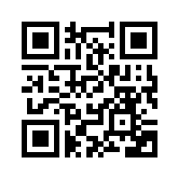

# GO-GP Mobile Application 

## Maria Munoz

I have had the privilege of working on this project in a professional capacity, and I'm excited to introduce the GO GP mobile application frontend to you! 🚀🚀

## Description

Welcome to the frontend of the GO GP mobile application.

Discover GO GP, a FREE application dedicated to package delivery between individuals. Simplify sending your packages by connecting travelers looking to optimize their route with individuals seeking to send packages cost-effectively.

GO GP offers advantageous services to both travelers looking to monetize their journey and package senders. With just a few clicks, you can post a travel announcement and find the perfect package sender for your packages.

This documentation provides a comprehensive guide on the installation, configuration, usage, and key features of the application's frontend.

## Development Team

- [Boubacar Traore](https://github.com/btboubacar)
- [Nassim Segura](https://github.com/NassimSEGURA)
- [Maria Munoz](https://github.com/munozmaria)
- [Lucas Bolivard](https://github.com/Lucsbol)

## Technologies Used

- React Native
- JavaScript
- Expo
- Socket.io (for messaging)
- Expo SDK (for camera, GPS, etc. management)
- Stripe (for payments)
- Cloudinary (for image and audio storage)

## Screenshots

## View the Published Application

To view the published application on your smartphone, follow these simple steps:

1. Make sure you have the Expo Go application installed on your smartphone. You can download it from the App Store (iOS) or Google Play Store (Android).

2. Once Expo Go is installed, launch the application.

3. Use the built-in QR code scanning function in Expo Go by tapping on the QR Code scan icon.

### QR code for iOS

4. Hold your smartphone in front of the QR code above to scan it.

5. Expo Go will automatically load the published application, and you can use it on your smartphone.

### QR code for Android

4. Repeat the process for the Android QR code above by scanning it with Expo Go.

5. Enjoy the published application on your Android device.

Have fun exploring the GO GP application and discovering its features!

## Features

The GO GP application offers a range of features to simplify package shipping between individuals, including:

- **Package Shipping**: Users can easily create package shipping listings by providing relevant details such as pickup location, destination, package size and weight, and the desired departure date.

- **Package Pickup**: Travelers can view available package shipping listings and choose to pick up a package that matches their route.

- **Real-Time Tracking**: package senders and recipients can track their packages in real-time using the integrated tracking feature, providing complete visibility into the delivery status.

- **Direct Contact with the Carrier**: Users can communicate directly with the carrier via the integrated messaging, facilitating coordination and communication throughout the shipping process.

- **In-App Payment**: Users can confidently conduct transactions without leaving the application.

These features aim to offer a smooth and secure user experience while optimizing the efficiency of package shipping between individuals.

## Usage

Follow these steps to use the application's features:

1. **Create an Account**:

   - Launch the GO GP application.
   - Tap "Create an account" to create a new account by providing the required information.
   - You will receive a confirmation email for your account.

2. **Ship a package**:

   - To initiate the package shipping process, please access the application's home screen and tap on the + tab at the bottom of the screen.
   - Fill in the details of your package, including pickup location, destination, desired departure date, and other relevant information.
   - Publish your shipping listing for travelers to see.

3. **In-App Payment**:

   - To make a payment within the application, follow these steps:
        1. Click on the "plane" icon ✈️ at the bottom of the screen to access posted shipping listings.
        2. Select the package listing you wish to pick up.
        3. Calculate the shipping price based on the specified conditions.
        4. Finally, proceed with payment using the integrated secure options.

4. **Communicate with the Carrier:**:

   - To establish direct communication with the carrier or sender and facilitate coordination throughout the process, follow these steps:
        1. Click on a listing that interests you to navigate to the detailed listing screen.
        2. Click the "send a message to ..." button; this will take you directly to the in-app messaging.
        3. Use the integrated messaging to exchange messages with the carrier or sender and clarify essential shipping details.
        4. Click on the "message" 💬 tab at the bottom of the screen, in the corresponding tab, to view all the people you've been in contact with and also find your messages and conversations.

5. **Messaging Features**:

   - The integrated messaging supports sending images and audio.
   - The ability to take photos with the smartphone's camera and then send them.
   - The ability to listen to recorded audio before sending.
   - Click on a photo to enlarge it.
   - Long-press on a message to bring up the delete option. The ability to select multiple messages simultaneously and perform a bulk delete.
   - Messaging uses socket.io technology by placing 2 users on a dedicated channel. Deleting a message by one user results in the deletion of the same message for the other user.
   - Text messages are stored in a database. Images and audios are stored in dedicated online services (here, Cloudinary).

The GO GP application aims to simplify package shipping between individuals by offering a smooth and user-friendly process, from creating listings to successful delivery.
